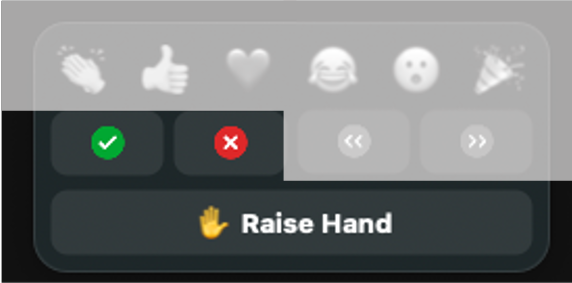

# Welcome to Computational Foundations for Biological Analysis

## About this workshop

- This workshop is targeted toward researchers who would like to be able to run
  computational analyses on their own. It assumes a very basic familiarity with
  genetics and serves as a pre-requisite to downstream workshops in Microbial Genomics
  and RNA-Seq analyses.

- By the end of the workshop, attendees will be able to
  - Use the Bash command line to move around the file system.
  - Use common commands to create, view, find, and transform text files.
  - Use Bash variables, arguments, and loops to automate repetitive tasks.
  - Combine Bash commands using file redirection and scripts.
  - Describe key datatypes in R/RStudio.
  - Read, transform, and summarize data using data frames.
  - Process data frames using loops.
  - Visualize data using plots.

- Our purpose is not to be exhaustive, and we don't expect anyone to be an expert
  at the end of the workshop. But we hope you will have a familiarity with key
  concepts, data types, tools, and how they all connect to one another in the
  service of a biological question.

- Please let us know if there is anything we can do to improve the workshop
  experience.

- This course content is adapted from the more comprehensive Data Carpentry
  Curriculum. For more information and more lessons, see:
  https://datacarpentry.org/lessons/#genomics-workshop

## Who are your hosts/instructors?

- Chris Gates cgates@umich.edu
- Dana King damki@umich.edu
- Evan Snitkin esnitkin@umich.edu
- Arianna Miles-Jay amilesj@umich.edu
- Helpers

# Housekeeping

## Code of Conduct (CoC)

- Be kind to others. Remember and respect that that participants come from
  different backgrounds, with different abilities, and distinct experiences.

- All communication should be appropriate for a professional audience including people of many
  different backgrounds.

- The University of Michigan is dedicated to providing a harassment-free community for everyone,
  regardless of gender, sexual orientation, gender identity and expression, disability, physical
  appearance, body size, race, or religion. We do not tolerate harassment of participants in any
  form.

- Thank you for helping make this a welcoming, friendly community for all.

- If you have questions about the CoC please reach out to the hosts during the workshop, or
  email us at bioinformatics-workshops@umich.edu.

- To report a CoC incident/concern, please email Chris Gates (Bioinformatics Core, Managing
  Director) at cgates@umich.edu or contact the University of Michigan Office of Institutional
  Equity at institutional.equity@umich.edu.

## Workshop patterns and Zoom controls

- We will be recording this session. Recordings will be available to attendees following
  the workshop.

- Zoom controls are at the bottom of the Zoom window:

- To minimize distractions, we encourage participants to keep their audio muted (1) (unless
  actively asking a question).
- To maximize engagement, we encourage participants to keep their video on (2).
- **Chat** can be used to communicate to the group or to individuals (3).
- **Reactions** is another way to communicate using "non-verbal controls"

  - **Raise Hand** to request clarification or ask a question. (Same an in-person workshop.)
  - **Green check** when you complete an assigned task or other instructor feedback
  - **Red "X"** to request assistance from helper
    - Hosts will connect you with a helper in a breakout room.

### Breakout Rooms

- We're all going to be transported into randomized breakout rooms to see what that's like.
- Introduce yourself. And come up with 1-2 reasons why it might be useful to know Bash command line.
- When you have completed introductions, you can leave the breakout room to rejoin the main room.

### Schedule

| Time | Topic | Instructor |
| ---- | ----------------- | ---------- |
| **Day One** |
| 9:00 | [Welcome & Introductions]
| 9:30 | [Introducing the UNIX Shell]
| | [Navigating the file system]
| | [Creating/removing files and directories]
| 10:30 | **Break**
| 10:45 | [Commands for viewing and manipulating files]
| | Review and questions
| 12:00 | **Break for lunch**
| 1:00 | [Searching files]
| | [Redirection / Pipes]
| 2:30 | **Break**
| 2:45 | [Loops]
| | [Scripts]
| | Review and questions
| 4:00 | End of day 1
| **Day Two** |
| 9:00 | [Introducing R/RStudio] | Evan Snitkin |
| | Programming basics
| 10:30 | **Break**
| 10:45 | Loading and analyzing data
| | base R and dplyr
| 12:00 | **Break for lunch**
| 1:00 | Conditionals | Arianna Miles-Jay |
| | Loops
| | Processing multiple files
| 2:30 | **Break**
| 2:45 | Plotting
| | Wrap up, questions, and next steps
| 4:00 | End of day 2

### Any questions?
 -
 -

---

*The workshop Code of Conduct has been adapted the NumFocus Code of Conduct (https://numfocus.org/code-of-conduct) which itself draws frin from numerous sources, including the Geek Feminism wiki, created by the Ada Initiative and other volunteers, which is under a Creative Commons Zero license, the Contributor Covenant version 1.2.0, the Bokeh Code of Conduct, the SciPy Code of Conduct, the Carpentries Code of Conduct, and the NeurIPS Code of Conduct.

This workshop content is licensed under a [Creative Commons Attribution 4 License](https://creativecommons.org/licenses/by/4.0/).
Much of the instructional content is derived and adapted from instructional content developed by Software Carpentry, Data Carpentry, and Library Carpentry:
http://software-carpentry.org/
https://creativecommons.org/licenses/by/4.0/
